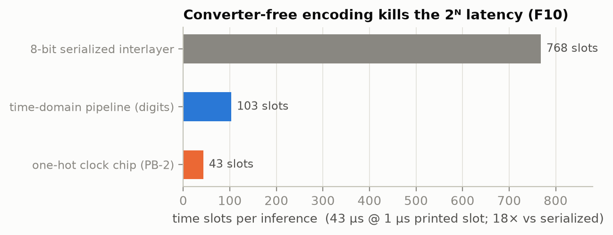
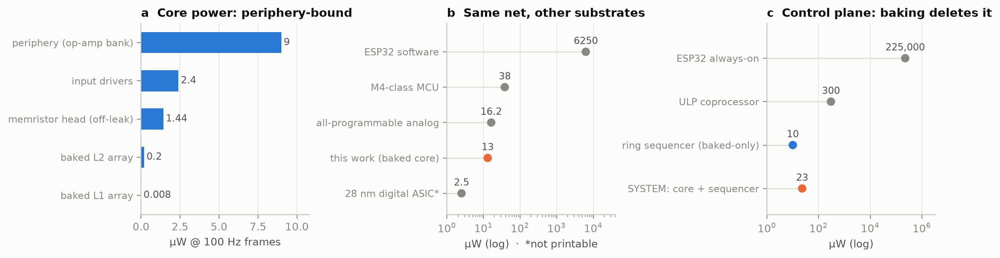
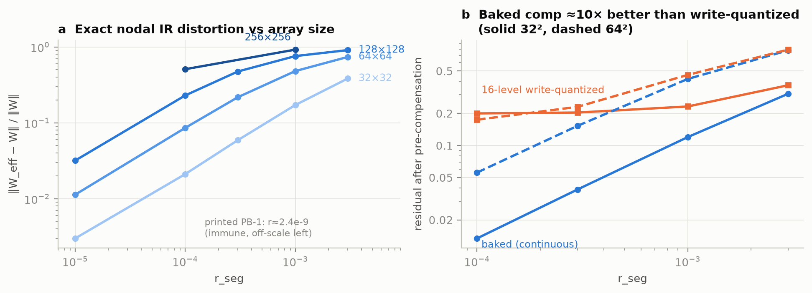
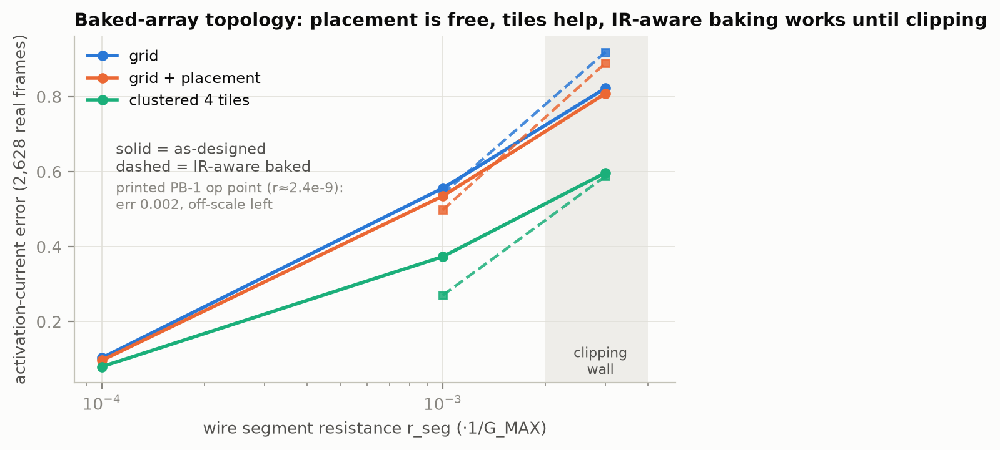
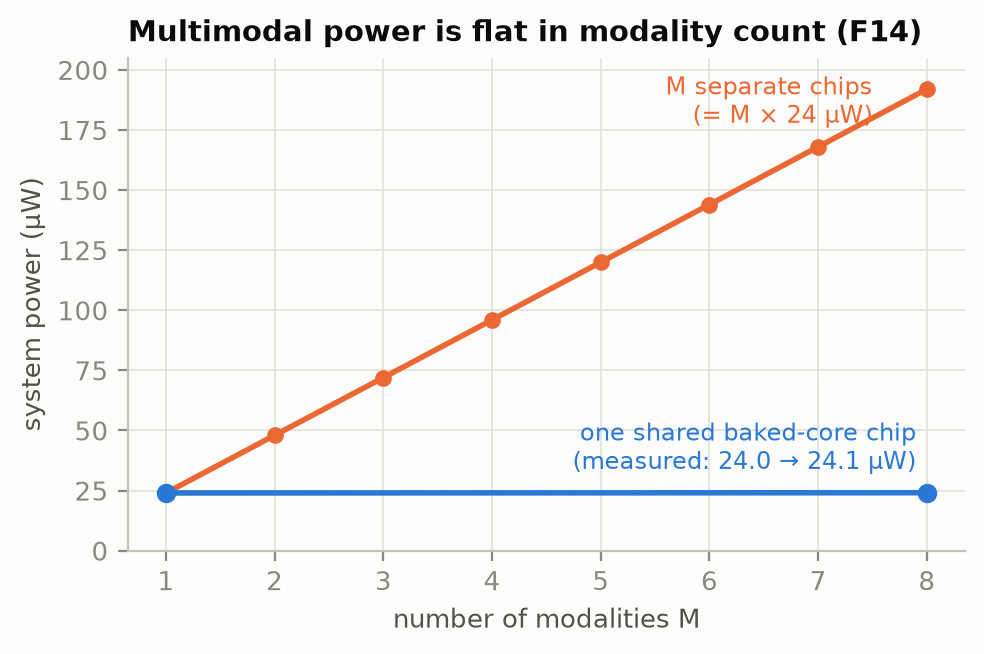
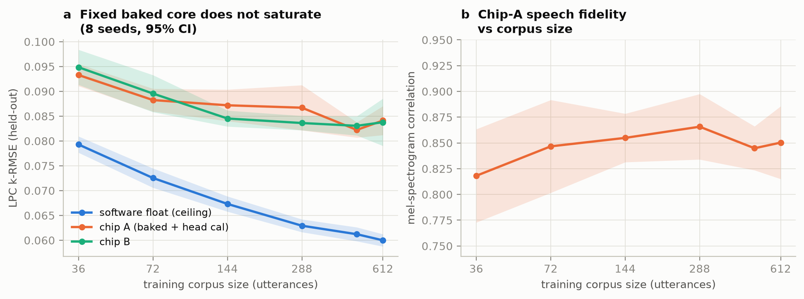
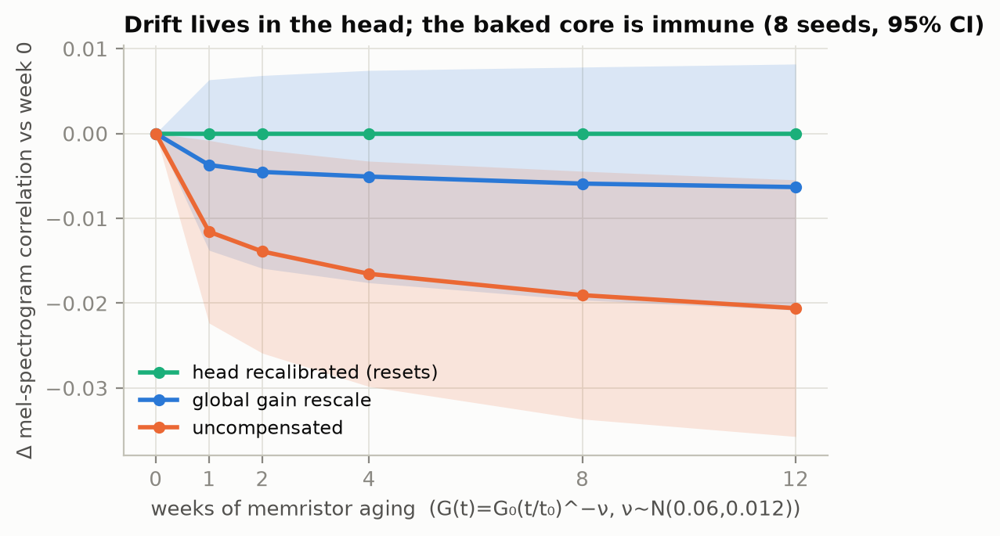

# 80_PAPER_DRAFT — Bake What Is Shared: a design law for hybrid fixed/programmable analog neural networks

*Draft v1, 2026-07-25. Assembled from 10_findings_v2 (F1–F15), 20_methods_env_v2,
30_design_rules_hardware, demo_pb2/RESULTS_v13, 70_literature_validation, and
topology_v14 (new this session). Everything in one place, per Avery's ask:
power draw (§6), passives beyond resistors (§7), converter-free input/output
schemes (§5), array topology & placement (§8), multimodal + recommended
architecture (§9). Status of every claim tracks the findings ledger — nothing
retracted/thinned has been rounded back up.*

---

## Abstract (draft)

Analog neural-network hardware faces a standing dilemma: programmable weights
(memristor/PCM) drift, leak, quantize coarsely, and need write-verify
machinery, while fixed weights cannot adapt. We present a systematic
design-space exploration of *partially baked* analog networks — where most
weights are permanently fabricated (printed/thin-film resistors) and a small
fraction remain electrically programmable — and distill it into a single
design law: **bake what is shared and stable; keep tunability private, small,
and placed where change enters.** Across a frozen-ratio sweep (30 seeds,
common-random-numbers protocol) we find no "safe plateau": accuracy declines
linearly (−1.03 pp per 10% frozen) with a knee at the output-layer boundary,
and the knee tracks architecture, not percentage (recovery is linear in
tunable output-neuron count, ~3 pp/neuron). Placement beats budget: baking the
right layers matters more than the fraction baked. One-hot time-domain
encoding eliminates input DACs, output ADCs, and the 2^N serialization
latency (18× fewer time slots), while buying ~15× rail-droop margin. Exact
nodal analysis shows printed high-resistance devices (1–10 MΩ) make crossbar
IR drop negligible by construction, and per-chip calibration of the small
programmable head absorbs fabrication spread *and* residual core IR
distortion. System power is periphery- and control-bound, not array-bound: a
fully baked core needs only a ring sequencer, yielding a 23 µW
talking-clock system versus 6.25 mW for an ESP32 software baseline. For
multimodal chips, a shared fully-baked fusion core with per-modality
programmable encoders wins on interference, forgetting, drift recovery, and
power (flat in modality count). We demonstrate the full stack with PB-2, a
printed talking-clock TTS chip (LPC-10, Speak&Spell lineage) that speaks all
720 clock times through one fixed baked core: the core does not saturate as
the vocabulary grows 17× (chip error flat at k-RMSE 0.084 ± 0.003 while the
software ceiling improves 24%; 8 seeds, 95% CI), and memristor aging
(physical t^−ν drift) degrades only the head — a global gain rescale
recovers ~70% of it, head recalibration all of it. The demonstrator is buildable as a 4-layer PCB plus
a 14×12 mm sputtered memristor daughterboard.

---

## 1. Introduction & claimed gap

Analog in-memory computing promises orders-of-magnitude efficiency gains but
inherits the liabilities of its programmable devices: conductance drift,
off-state leakage, write quantization (~4-bit routine), programming noise,
and per-frame control overhead. Meanwhile printed/thick-film resistor
networks are stable for decades but fixed forever. Between "all programmable"
and "all fixed" lies a design space — *how much of a network to bake, and
where* — that the literature has not systematically mapped. Prior work
studies crossbar accuracy under device noise (e.g. AIHWKit-style analyses)
or fixed-function analog blocks, but a **frozen-ratio DSE** — with placement,
encoding, power, IR, drift, and multimodal topology treated as coupled
choices — is, to our knowledge, absent.

**Thesis (the design law).** *Bake what is shared and stable — it neither
drifts, nor leaks, nor interferes, nor (at printed operating points) suffers
IR drop. Keep tunability private, small, and placed where change enters.*

Every result below is an instance of this law. §10 compresses them into 12
engineering rules; §11 gives the physical build path.

## 2. Contributions

1. Frozen-ratio DSE under a paired-noise (CRN) protocol: no plateau; linear
   decline with an output-boundary knee that tracks architecture (F1, F8).
2. Placement > budget: baking *order* dominates baking *fraction*; scattered
   tunables are the worst allocation (F7).
3. Converter-free encoding: one-hot time-domain input + pulse-width
   interlayer chaining + first-spike readout kills the ADC/DAC tax — latency,
   power, and IR sensitivity together (F10, §5).
4. System power decomposition from real charge flow: periphery/control-bound,
   not array-bound; baking collapses the control plane to a sequencer
   (23 µW system) (F13, §6).
5. Passive temporal computation: printed RC networks as baked context memory
   (causal streaming front end at parity with lookahead), bitline capacitors
   as the integrate stage (F12b, §7).
6. Per-chip head calibration absorbs the fab lottery *and* exact-nodal IR
   distortion (F11, F15, §4).
7. Exact nodal IR analysis: static masks underestimate distortion up to 5×;
   high-R printed devices are immune by construction; baked pre-compensation
   is ~10× better than write-quantized (F15).
8. Array topology study: permutation placement and clustered tiling of the
   baked sections; IR-predictive baking (topology_v14, §8).
9. Multimodal law: shared baked core + programmable edges wins on every
   axis; power flat in modality count (F14, §9).
10. End-to-end demonstrator: PB-2 talking clock, 720 utterances through one
    baked core, no saturation; physical drift model in the loop; open
    hardware build path (F12, RESULTS_v13, §11).

## 3. Methods (summary; full protocol in 20_methods_env_v2)

**Simulation stack.** NumPy nodal/behavioral models; sklearn digits and a
24-word command vocabulary for classification studies; espeak-ng + MBROLA us1
diphone speech as the TTS teacher. AIHWKit used for an independent
cross-validation arm on the ratio study (its CRN port is queued — v4–v12
statistics are numpy-side).

**Statistical protocol.** Common random numbers: every (seed, condition)
draws device/fine-tune noise from a SeedSequence keyed so contrasted
conditions see identical draws — this tightened IR contrasts 10–20× and
exposed one spurious v1 result. 30 seeds for the core ratio study; paired
per-seed tests with 95% CIs; McNemar on per-sample correctness for
within-test-set contrasts. Plateau claims require per-seed OLS trend tests.

**Device model.** Baked: multiplicative 5% fab spread (SIGMA_FAB), ohmic,
drift-free, leak-free (idealizations bounded in §12). Programmable head:
16 write levels + 4% programming noise (SIGMA_PROG), on/off 30, drift by the
physical PCM/RRAM power law G(t) = G₀(t/t₀)^−ν, ν ~ N(0.06, 0.012) per
device. Literature anchoring for every constant: 70_literature_validation
(Joshi et al. 2020 measured ~3.8% programming error and ν≈0.06; 4-bit is the
no-heroics precision; printed-resistor 5% is a good-process number, typical
untrimmed is ~10%).

**Time-domain model.** Activation → pulse width; per-layer window with R
resolvable slots (jitter N(0, T/R)); ceilings calibrated at design time
(99.5th-pct train activation); first-spike WTA for classification. R is an
abstraction over integrator/comparator specs (circuit mapping queued).

**TTS pipeline.** LPC-10 at 8 kHz, 25 ms/10 ms frames (10 reflection
coefficients + F0 + gain + voicing) — the TMS5100/Speak&Spell codec.
|k|<1 lattice stability is the built-in noise tolerance; the codec shipped
at 3–6 bits per coefficient in 1978, which is exactly why a few percent of
analog perturbation is survivable. Objective proxy: 24-mel log-spectrogram
correlation (ceiling 0.994 = codec-transparent). No listening test yet (§12).

**Power model.** Array energy V²·ΣG_active·t_pulse from real weights and
real utterance charge flow; leak charged whenever a stage sees voltage;
periphery as per-channel bias × window duty; control-plane scenarios
separate. Constants order-of-magnitude, declared in script headers.

**IR model.** Exact sparse-Kirchhoff nodal solve of every wordline/bitline
segment (differential planes share wordlines — worst case), splu with
multi-RHS: exact, input-independent W_eff per the linearity theorem (ohmic
array + ideal drivers + virtual-ground sense ⇒ linear network). Rail droop
handled separately as the only input-dependent term.

## 4. The frozen-ratio results (what to bake, and where)

- **No plateau (F1, revised).** Digits 64-48-24-10, forward baking order:
  post-shift accuracy declines −1.03 pp per 10% frozen across 0–90%
  (t=−15.2, p=2.3e-15, 30 seeds); AIHWKit arm −1.47 pp/10%. The "60–90%
  sweet spot" folklore is a resolution artifact of small-n studies (paired
  sd ≈ 4.5 pp at n=5 can't see 1 pp/10% slopes).
- **The cliff is the output boundary in disguise (F8).** For budgets inside
  the output layer, accuracy = 0.424 + 3.04 pp × (tunable output neurons),
  R²=0.90. Across four architectures (1.9k–32k weights) the knee sits at
  each one's own output boundary (93.8–97.0% frozen); per-neuron slope grows
  with width. Output-layer-only tuning = 3.0% of weights recovers 95% of
  full-programmable adaptability in the largest model.
- **Placement beats budget (F7).** At identical device cost, reverse order
  (bake the classifier, keep input layer tunable) beats forward by
  +2.0–2.3 pp in low/mid-frozen regimes when the deployment shift is
  input-space; forward dominates in the extreme-frozen regime; random
  scattering is worst everywhere high (partial control of every layer, full
  control of none). Corollary: size the tunable part by *structure* — the
  full span of the layer where the shift enters plus the complete output
  layer — never by percentage.
- **Bigger bakes better (F9, caveated).** Max frozen fraction at ≥90%
  recovery rises 60.5%→90.0% with model size while device cost falls; task
  was fixed, so a matched-capacity control is required before claiming this
  generally (queued).
- **Baked can beat programmable on clean accuracy (F5).** +2.04 pp clean
  accuracy per 100% frozen (numpy arm): 16-level write quantization damages
  delicate functions more than 5% continuous fab spread. Reappears
  independently in the trimodal study (baked fusion core 0.810 vs
  programmable 0.743 on the comparison head).
- **Adapters are insurance, not magic (F3).** A parallel low-rank adapter
  (B=0 dormant init = free option) wins only in the extreme-frozen regime
  and works by *coverage* (restoring access to all classes), not rank; with
  programmable edges its effect is ≈0.
- **Drift (F4, thinned; extended by v13).** Only the 0% vs 68.8% frozen
  contrast survived the paired protocol in v4. The v13 re-run with the
  physical t^−ν model on the PB-2 head (8 seeds, paired per-seed deltas,
  §11): uncompensated spectrogram correlation declines −0.021 ± 0.015 over
  12 weeks (worst seed −0.048), monotone in every seed; a single global
  gain rescale recovers ~70% (drift is largely common-mode); head
  write-verify recalibration resets to fresh. The baked core is drift-free
  by construction — that is the point of the law.

## 5. Input/output schemes — killing the ADC/DAC tax (F10)

The "2^N latency" and converter power of analog NNs exist only where a
digital value is serialized through a DAC or captured by an ADC. All three
interfaces can be restructured so no conversion ever happens:

- **Inputs: one-hot / binary lines.** A one-hot line is 1 time slot with
  zero input timing precision required. For symbolic/categorical inputs
  (phones, words, classes, sensor buckets) this is free. Bonus: binary
  inputs raise first-layer SNR — the clock-word task hit 0.980 fidelity at
  R=8 and 0.9965 at R=16, versus R=32–64 needed with analog-amplitude
  inputs. Bonus 2 (couples to IR, F15): one-hot(4-of-128) drive incurs
  0.3–3.0% rail droop where dense-50% drive hits 4.5–32% — a ~15× sparsity
  margin on the only input-dependent IR term.
- **Interlayer: continuous pulse-width chaining.** Integrator + comparator
  turns a bitline charge into a pulse width directly; the value is never a
  code. Precision knob R = window/jitter; R=32 suffices for digits (0.956 vs
  0.968 float), R=16 for one-hot vocab tasks.
- **Output: first-spike winner-take-all** = analog argmax; matches windowed
  argmax by R=32 and decides at 60–70% of the window. For regression outputs
  (LPC coefficients), the pulse width itself is the output — the PB-1/PB-2
  signal path contains **no ADC anywhere**.
- **Latency ledger.** Classic 8-bit interlayer serialization: 768 slots.
  Digits pipeline: 103 (7.5×). One-hot clock chip: 43 slots (18×) — 43 µs
  per inference at a 1 µs printed slot against a 5 ms speech frame, i.e.
  latency stops being the constraint at all.
- **Prior-art positioning (70_ §7).** PWM/time-domain analog compute without
  converters is established (Morie group, ~300 TOPS/W in 250 nm; ISCAS'17
  PWM crossbar): cite for feasibility. The differentiated pieces here are
  (i) one-hot inputs specifically (zero timing precision + SNR + rail-droop
  margin) and (ii) coupling time-domain encoding to the baked/programmable
  split, where eliminating the converter also eliminates the *control plane*
  (§6).


*Fig. L — Converter-free encoding removes the 2^N serialization latency
(F10): 43 µs/inference at a 1 µs printed slot, 18× vs 8-bit interlayer
serialization, against a 5 ms speech frame.*

## 6. Power draw (F13) — measured from real charge flow

All numbers from chip-A conductances and real utterance charge flow at
100 Hz frame rate (v9 power study), constants order-of-magnitude:

| block | µW | share |
|---|--:|--:|
| periphery (op-amp bank, 13 ch) | 9.0 | 69% |
| input drivers (CV², 74HC595-class) | 2.4 | 18% |
| memristor head (mostly OFF-leak: on/off=30 × 832 dev) | 1.44 | 11% |
| baked L2 array | 0.20 | 1.5% |
| baked L1 array | 0.008 | <0.1% |
| head reprogram (amortized) | 0.00014 | — |
| **core total** | **13.0** | |

Baselines, same 7,584-MAC network: ESP32 software 6,250 µW; M4-class MCU
38 µW; 28 nm digital ASIC 2.5 µW (not printable); all-programmable analog in
same-µpower parts 16.2 µW.


*Fig. P — (a) The 13 µW core is periphery-bound: both baked arrays together
draw 0.21 µW. (b) Same network on other substrates (log scale). (c) The
control-plane ladder: baking enables the 10 µW ring sequencer, deleting the
225 mW always-on controller — 23 µW total system.*

**Control plane is the real fight.** ESP32 always-on: 225,000 µW. ULP
coprocessor: 300 µW. **Autonomous ring sequencer: ~10 µW → 23 µW total
system.** The sequencer is *uniquely enabled by baking*: a fully baked core
needs no per-frame weight loads, no write-verify, no intelligent controller
at inference — the network **is** the ROM (F6). This is the
conversion-dominance finding extended to control: baking doesn't just save
array energy, it deletes entire subsystems.

Key scaling facts:
- **Resistance is a free knob.** Array power spans 5 decades before hitting
  the 9 µW periphery floor; thermal noise limits R_unit only above 758 MΩ at
  R=32 read levels. Choosing 1–10 MΩ printed devices simultaneously makes
  array power negligible *and* IR drop vanish (r_seg ≈ 2.4e-9 on the PB-1
  board) — the power choice and the IR choice are the same choice.
- **Leakage corollary.** Every device moved from the memristor head into the
  baked side deletes its off-leak permanently (no voltage, no leak). The
  head should be as small as the F8 boundary rule allows. A leakage-aware
  frozen-ratio Pareto is queued.
- **Where the edge is.** The conversion-elimination advantage shrinks toward
  large N (per-neuron converter cost grows slower than weight count) —
  baking's energy edge is largest at edge scale, the same place its
  manufacturability edge lives.
- **Periphery ladder (rule 10, estimated).** Op-amp bank 9 µW → shared
  S/H-muxed op-amp 0.9 → dynamic clocked comparators 0.06 → RC + OTS/NbO₂
  relaxation oscillators (zero-transistor integrate-and-fire) ~0.01. The
  next factor-of-100 in system power lives in the periphery, not the arrays;
  §7 is the path.

## 7. Resistor networks + other passives (caps, RC — baked temporal computation)

The baked sections need not be purely resistive. Printed capacitors extend
the design space in three load-bearing ways:

- **Bitline capacitance is the integrate stage.** The MAC's accumulate
  operation is ∫i·dt on the bitline capacitor — a passive already in the
  signal path (the demo viewer renders exactly this: caps filling with
  charge). Sizing C_bitline against the pulse window sets the noise/speed
  trade directly; no op-amp integrator is required in the relaxation-
  oscillator periphery limit (§6 ladder).
- **RC low-pass banks = causal context memory (F12b).** Replacing the
  prev/next phone lookahead lines with printed-RC low-passed copies of the
  current one-hot (τ = 30 ms, 100 ms) achieved spectrogram correlation
  0.874 ≥ 0.859 (lookahead), with 75 lines vs 80 — **parity at fewer lines,
  strictly causal, streaming-capable**. A resistor bakes a static weight; an
  RC pair bakes a *temporal* weight. (The ">" may be vocabulary-scale
  redundancy; claim parity. Printed caps put ~5% tolerance on τ — in the
  noise model.)
- **CR high-pass banks = onset/delta features** (rule 11): the derivative
  features that spiking front ends compute actively fall out of a printed
  high-pass for free. Untested in-sim; queued.
- **Charge-integration in encoders/decoders.** Avery's question "could RC
  play a role in integrating charge in encoders or decoders?" — yes, twice:
  (i) encoder side, an RC bank over one-hot input lines is a baked temporal
  embedding (the F12b result); (ii) decoder side, the bitline cap + pulse
  window already implements the output integration, and slow RC on head
  outputs could bake output smoothing (the 3-frame LPC smoothing currently
  done in synthesis) into the analog path. The audio filterbank front end
  (§9) is the third instance.
- **What stays honest:** τ tolerance (~5%) is modeled as noise but long-term
  printed-cap stability (dielectric aging) has no citation yet — same status
  as the printed-resistor stability gap (70_ §8.5).

## 8. Is a grid the best arrangement? Topology & placement of the baked sections (NEW, topology_v14)

Motivation: the baked core is *printed* — we are not bound to the regular
crossbar that lithographed memories inherit. Two degrees of freedom come
free or cheap: **where** each weight sits in the array (routing order), and
**whether** the array is one monolith or several clustered tiles. And
because the baked core is ohmic, its IR distortion is *exactly predictable*
(F15 linearity theorem: W_eff is input-independent and computable at design
time) — so any layout can be pre-compensated at bake time: predict the IR,
then build the model with it.


*Fig. IR — v12 exact-nodal study. (a) Raw W_eff distortion grows with array
size and r_seg; the printed PB-1 operating point (r_seg≈2.4e-9) is off-scale
immune. (b) Design-time pre-compensation with continuous baked conductances
beats 16-level write-quantized compensation ~10× in the feasible regime —
IR correction is itself an argument for baking.*

Setup: real trained PB-2 baked weights (L1 92×64, L2 64×32), driven by the
real utterance frames; exact nodal solver throughout; r_seg swept 1e-4–3e-3
to expose differences (the printed PB-1 operating point, r_seg≈2.4e-9, is
IR-immune regardless — this section matters for denser/lower-R
implementations: sputtered cores, finer pitches, research arrays).

Three interventions:
- **T1 placement (free):** permute rows/columns of the same grid — heavy
  columns near the drivers (wordline R grows with column index), heavy and
  frequently-driven rows near the sense edge (bitline R grows with distance
  from sense). Function is unchanged; only where IR accumulates changes.
- **T2 clustered tiles (shrinks):** k-means co-cluster output columns by
  which input rows they actually use; prune sub-threshold weights (a printed
  resistor you simply don't print); compact away rows a tile doesn't use.
  Each tile is a smaller crossbar with shorter lines; tile outputs join on a
  short bus into the shared virtual-ground integrator (join-bus series R
  modeled). Metrics: exact W_eff distortion, activation-current error on
  real drive patterns, device count, footprint, wire length.
- **T3 IR-aware baking:** run the F15 fixed-point compensation *per layout*
  — bake conductances such that the predicted W_eff of this geometry equals
  the target weights. Continuous (baked) values only, since F11/F15 already
  showed 16-level write-quantized compensation floors ~20%.

**Results** (topology_v14/results_topology_v14.csv; L1 representative rows,
activation-current error on 2,628 real frames):

| layout | r_seg | W_eff err | act err raw | act err + IR-baked | clip | wire rel |
|---|--:|--:|--:|--:|--:|--:|
| grid            | 1e-4 | 0.084 | 0.103 | — | — | 1.00 |
| grid+perm       | 1e-4 | 0.076 | 0.096 | — | — | 1.00 |
| tiled k4 θ0.05  | 1e-4 | 0.089 | **0.080** | — | — | 1.43 |
| grid            | 1e-3 | 0.484 | 0.556 | 0.540 | 2.3% | 1.00 |
| grid+perm       | 1e-3 | 0.455 | 0.535 | 0.498 | **1.0%** | 1.00 |
| tiled k4 θ0.05  | 1e-3 | 0.428 | 0.373 | **0.270** | 11.4% | 1.43 |
| grid            | 3e-3 | 0.751 | 0.822 | 0.919 (!) | 22.2% | 1.00 |
| tiled k4 θ0.05  | 3e-3 | 0.674 | 0.597 | 0.588 | 30.6% | 1.40 |


*Fig. T — L1 activation-current error on 2,628 real frames vs r_seg. Solid:
as-designed; dashed: IR-aware baked. Placement (orange) is free and always
helps; 4-tile clustering (aqua) halves compensated error at r=1e-3; inside
the shaded clipping wall compensation backfires (rule 12).*

Four findings:
1. **Placement is free and always helps**: pure permutation buys ~5–10%
   relative distortion reduction and halves conductance clipping in the
   compensation regime (2.3%→1.0%), extending the feasible range of
   IR-aware baking. Never place weights in arbitrary order.
2. **Clustered tiling is an electrical win, not an area win (for this
   network)**: k=4 tiles cut activation-current error ~2× under IR-aware
   baking at r=1e-3 (0.540→0.270) by shortening wordline runs, at ~40%
   wire-length overhead and per-tile wordline feeds.
3. **Area did not shrink — the honest headline.** Even pruning 60% of
   devices, nearly every input row remains used in every tile: the trained
   W is dense, so row compaction never triggers. **A grid is area-optimal
   for a dense weight matrix; topology only shrinks the array if the model
   is trained to be clusterable** (group-sparsity at train time so tiles
   own disjoint row subsets — queued, and it upgrades "bake against the
   predicted IR" to "train with the layout in the loss").
4. **IR-aware baking works until the clipping wall, then backfires**: at
   r=3e-3, 22–31% of cells demand >G_MAX and compensation makes the grid
   *worse* than raw (0.822→0.919) — F15's wall, reproduced per-layout;
   past it, re-architect (rule 12).

Interpretation against the design law: placement and clustering are *baked*
decisions — they cost nothing at runtime, don't touch the programmable
budget, and compose with head calibration (which absorbs whatever residual
distortion survives, F11). The grid is not sacred; it is simply the layout
whose IR is worst-case-uniform. When the operating point is already immune
(printed high-R), topology is an *area* play; when it is not (dense/low-R),
topology is an *accuracy* play, and predictive pre-compensation turns the
deterministic part of IR into a solved problem up to conductance clipping.

## 9. Multimodal: architecture for a scene-describing chip (F14 + recommendation)

**The evidence (F14, v8→v10→v11).**
- Baked *encoders* are the worst choice: forcing plasticity into the shared
  resource maximizes interference (−20.5 pp collateral, −21 pp ping-pong
  forgetting).
- The full enc×core grid puts the best cell on every axis at **programmable
  encoders + fully baked core**: recovery +45.4 pp, collateral −0.9 pp,
  forgetting −3.1 pp, and cheaper than the programmable-core neighbor
  (33 vs 36 µW — a baked core doesn't leak).
- **Power is flat in modality count:** one shared baked-core chip runs
  24.0 µW at M=1 and 24.1 µW at M=8 (quiescent encoders see no voltage,
  hence no dynamic power *and no leak*), versus 192 µW for M separate chips.


*Fig. M — System power vs modality count (F14, v10 measured endpoints).
Adding a modality to the shared baked core costs +0.1 µW; separate chips
scale as M × 24 µW.*
- Trimodal fusion (image+text+audio on an analog sum bus, dual heads):
  baking the core costs ≈nothing on the fused head (0.995 vs 0.994) and is
  *better* on the delicate comparison head (0.810 vs 0.743 — the F5
  quantization mechanism). Drift recovery works through encoder-side
  adaptation alone (0.886); untouched heads are protected (0.880 vs 0.816).
  A never-trained output class is learnable post-fab through edge plasticity
  equally well with a baked core (0.48 vs 0.51 prog — indistinguishable;
  frozen mixing is re-purposable).

**Recommended architecture for Avery's proposal** (text encoder + image
encoder + audio encoder → one shared core → "describe what's happening"
outputs):

```
TEXT  one-hot/hash lines ─→ [prog. memristor adapter A_t] ─┐
IMAGE photodiode/pixel lines → [prog. adapter A_i] ────────┼→ analog SUM BUS
AUDIO ──→ printed RC/LC filterbank (constant-Q) ──→        │   (normalized)
          rectify+integrate lines = mel-ish energies        │
          → [prog. adapter A_a] ───────────────────────────┘
                     ↓
        FULLY BAKED shared fusion core (2–3 layers, printed R,
        one-hot/time-domain interlayer, high-R devices, IR-immune)
                     ↓                    ↓                   ↓
        [memristor head 1]      [memristor head 2]   [memristor head k]
         scene-class WTA          salient-object       prosody/alarm/
         (first-spike)            one-hot lines        LPC speech out
```

Design decisions, each tied to a finding:
1. **Fully baked core — yes** (her question "would you still want a fully
   baked core?"): F14 says the fully-baked cell wins every axis; F5 says the
   core's delicate mixing functions are exactly what write quantization
   damages most. Do not put memristors in the core.
2. **Memristors "one layer away" — exactly right, on both sides.** Her
   instinct matches the data: tunability belongs at the *edges* — thin
   programmable adapters per modality just before the sum bus (input-space
   shift is absorbed where change enters, F7), and per-function memristor
   heads after the core (output boundary, F8). The heads are private per
   output section, so multiple output sections are not just allowed but
   protective: v11 showed untouched heads stay intact while one is retuned.
3. **Audio input: Fourier-by-construction, not ADC+FFT.** Her "Fourier
   transformed series of audio input lines" should be a printed/passive
   constant-Q RC (or gm-C) filterbank feeding rectify+integrate lines —
   mel-like energy lines with zero converters, the §7 passives story applied
   at the sensor edge. Raw-audio-in is what the filterbank takes; the chip
   never sees samples. (16-mel × 8 time slices was the sim's audio encoding.)
4. **Sum-bus fusion** (normalized analog sum) — the v11 mechanism; cheap,
   and modality gating means absent modalities cost nothing. **Open item
   flagged honestly:** modality dropout / absent-modality operating-point
   shift on the sum bus is untested (queued P0) — the bus normalization
   needs a dropout experiment before the flat-power claim is end-to-end.
5. **Dormant parallel adapter across the core (B=0) only if the edges will
   ever be baked** (F3): with programmable edges it does nothing; as fab
   insurance it is free until programmed.
6. **Scale honesty** (she said "a very large chip to be meaningfully
   useful"): F9 (bigger bakes better) is encouraging but has the
   overparameterization caveat; F13 says the energy edge is largest at edge
   scale; F15 says wide low-R arrays hit conductance clipping — the §8
   clustered-tiling results are the scaling path (split the core into
   co-activation tiles rather than one monolith). A useful first physical
   target is a *small* scene-classifier (e.g. a few dozen scene/event
   classes from mic + low-res photodiode array + a few text/GPIO lines),
   which is PB-2-scale hardware, not vaporware.

## 10. Design rules (the law, operationalized — 30_design_rules)

1. Size the tunable part by structure, not percentage (F7/F8).
2. Don't scatter tunable columns (F7).
3. Input-space shift → tunable input layer; output-space → tunable head (F7).
4. One-hot/binary input lines wherever the domain allows (F10, F15).
5. Continuous time-domain interlayer chaining, R=16–32; first-spike WTA
   outputs (F10).
6. Per-chip head calibration is mandatory and free — calibrate through the
   real hardware (F11).
7. Multimodal: baked shared core, programmable encoders/decoders; dormant
   adapter iff edges baked (F14, F3).
8. Choose high device resistance (1–10 MΩ printed): power and IR immunity
   are the same choice (F13, F15).
9. Leakage-aware ratio: head as small as F8 allows (F13).
10. Periphery ladder: op-amps → muxed → clocked comparators → RC+OTS
    relaxation (F13).
11. RC/CR printed passives are baked temporal computation (F12b).
12. IR: exit, don't mitigate (high-R + fat copper); if stuck low-R,
    design-time pre-compensation until clipping, then re-architect (F15).
    *(v14 adds: and choose placement/tiling with the predicted IR in hand.)*

## 11. The demonstrator: PB-1/PB-2 talking clock (F12, RESULTS_v13)

**Why a talking clock:** categorical input (time words → one-hot), a real
perceptual output (speech), a historically noise-tolerant representation
(LPC-10 — TMS5100 shipped it at 3–6 bits/coefficient), and a natural scaling
axis (36 → 720 utterances).

**Chip:** 92 one-hot phone-context lines → baked 92×64 → baked 64×32 →
32×13 memristor head (≈5% of weights, per-chip ridge write-verify
calibration) → 13 pulse-width outputs → all-pole lattice synthesis. No ADC
in the signal path; R=32.

**Headline scaling result (v13, 8 seeds ×  per-seed train/test splits,
95% CI):** with the architecture *fixed*, growing the corpus 36→612
training utterances (full 720-minute natural-English time space, 29 phones,
127k frames): float ceiling improves monotonically (k-RMSE 0.0793 ± 0.0016
→ 0.0600 ± 0.0012, −24%) while chip error never trends upward (chip A
0.0933 ± 0.0022 → 0.0841 ± 0.0029; chip B statistically identical) and
spectrogram fidelity holds at 0.85 ± 0.04 across the sweep (40-utterance
mel sample). **The fixed baked core does not saturate** — the bounded cost
is head-calibration/quantization precision (a fixed additive overhead), not
core capacity. One physical chip speaks the entire clock.


*Fig. S — (a) Float ceiling improves with corpus size while both simulated
chips track a flat, bounded offset above it. (b) Chip-A speech fidelity
holds ~0.85 across a 17× corpus growth. 8 seeds, per-seed splits and fab
draws, 95% CI.*

**Drift (v13, 8 seeds, paired per-seed deltas):** physical t^−ν on the
head only, one fixed per-device ν draw per seed (ν ~ N(0.06, 0.012)).
Uncompensated fidelity declines monotonically in every seed: Δmel-corr
−0.012 ± 0.011 at week 1 and −0.021 ± 0.015 at week 12 (worst seed −0.048);
a single global gain rescale recovers ~70% (−0.006 ± 0.015 at week 12);
head recalibration resets exactly. Baked core immune by construction.
*Correction vs the earlier single-seed series:* the previously reported
0.90→0.79 drop redrew per-device ν independently at every week point,
conflating device-draw variance with aging, and landed on a tail draw —
the paired multi-seed estimate above is the defensible number, and it is
milder (the head is only ~5% of weights; there is simply not much drift
surface). The demo audio renders per-seed worst cases, which remain
audible.


*Fig. D — Change in mel-spectrogram correlation vs week 0 (paired within
seed). Every seed declines monotonically without compensation; one global
gain scalar recovers most of it; write-verify recalibration resets to
fresh. The baked core does not appear in this figure because nothing in it
drifts.*

**Hardware path (PB-1 rev A):** 140×180 mm 4-layer FR-4; differential
carbon-resistor planes (G⁺/prepreg/G⁻) joined per-bitline by vias; Cu
wordlines top, returns bottom. L1 120×96 mm + L2 96×48 mm at 1.5 mm
screen-print pitch (thick-film 0.4 mm → 23 cm²; inkjet → 36 cm²). Head:
14×12 mm glass daughterboard — sputtered Ti/Pt stripes, ~50 nm TiO₂₋ₓ
blanket, Pt/Ag top stripes, parylene cap — shadow-mask compatible with a
lab-scale sputter coater. Periphery: 13× integrator+comparator, 10× 74HC595
drivers, ring sequencer for inference; ESP32 for programming/refresh only.
23 µW system. An all-memristor equivalent would need ~24 cm² of sputtered
oxide and ~15k write-verify ops vs 832 — the hybrid split is what makes the
board shop-buildable.

**Live demo:** interactive die viewer (clock face → hear the chip; current
heatmap where charge physically flows; bitline caps filling; labeled one-hot
input channels; memristor-aging slider recomputing the head live while the
baked core stays frozen).

## 12. Honest limitations ledger

Toy tasks (8×8 digits, 24-word vocab, clock-domain speech); v13
scaling/drift curves now carry 8-seed 95% CIs with per-seed train/test
splits (seeds_v13), but the classification studies (v4–v11) remain
fixed-split;
AIHWKit CRN cross-validation port not yet run (all v4–v12 statistics
numpy-side); energy constants order-of-magnitude and digital baselines
exclude their own I/O; no standardized intelligibility test (mel-spec
correlation proxy only); baked core assumed perfectly drift/leak-free
(printed-resistor long-term-stability citation missing); 5% printed
tolerance is a good-process number (typical untrimmed ~10%) — stated as a
process requirement absorbed by calibration; nodal solver ohmic-only
(memristor I–V nonlinearity fine at 32-wide head, required before scaling
the programmable fraction); compensation fixed point under-converges in the
strong-IR regime (residuals are upper bounds); modality dropout on the sum
bus untested; RC τ tolerance modeled but printed-cap aging uncited;
R_LEVELS lacks a circuit mapping; F9 needs a matched-capacity control; F2
(variance-first) remains retracted-pending; topology_v14 electrical model
charges inter-tile wordline routing to wire length, not to the nodal solve.

## 13. Pre-submission checklist

1. ~~Multi-seed error bars~~ DONE (seeds_v13: 8 seeds, per-seed splits,
   40-utt mel sample; Figs. S and D; drift magnitude corrected — see §11).
2. Human verification of every citation in 70_literature_validation
   (subagent-gathered; URLs/DOIs must be checked by hand).
3. AIHWKit CRN port (P0 #1) for the ratio-study cross-check.
4. Modality-dropout experiment (P0 #3) before leaning on flat-power.
5. Optional strengtheners: matched-capacity F9 control; small listening
   test or ASR word-accuracy proxy; RC-causal streaming variant at v13
   scale.

## References (to verify by hand — from 70_literature_validation)

- Joshi et al., "Accurate deep neural network inference using computational
  phase-change memory," *Nat. Commun.* 11, 2473 (2020). [σ_prog ≈ 3.8%,
  4-bit, ν≈0.06 drift law]
- "Achieving high precision in analog in-memory computing systems," *npj
  Unconventional Computing* (2025). [correct-to-5% conductance band]
- Ielmini group, "Reliability of analog resistive switching memory…," *APL
  Phys. Rev.* 7, 011301 (2020). [σ_R/R ∝ R^0.5]
- Rasch et al., *APL Machine Learning* 1, 041102 (2023). [AIHWKit]
- Rao et al., *Nature* 615, 823 (2023). [2,048 levels with heroics]
- Song/Rao et al., *Science* 383, 903 (2024). [multi-device precision]
- Le Gallo et al., 64-core PCM mixed-signal chip (2022). arXiv:2212.02872.
- IEDM/IEEE 8993482 (2020). [drift compensation at scale]
- TMS5100/Speak&Spell LPC-10 bit allocation (6,6,5,5,4,4,4,4,3,3);
  FS-1015 LPC-10e at 2.4 kbit/s; Wong et al., Eurospeech 1989.
- Yamaguchi et al., arXiv:1902.07707 (2019). [PWM time-domain, ~300 TOPS/W,
  no ADC/DAC]; Miyashita et al., ISCAS 2017. [PWM crossbar engine]
- Chen, *IEEE TED* (2013). [exact line-resistance crossbar model]
- 1S1R finite-wire-resistance analysis (Adv. Intell. Syst.). [38.5% vs
  85.9%; 100–200 kΩ prescription]
- Printed/thick-film resistor tolerance & stability: Microelectronics
  Reliability S0026271412001102, S0026271418301252; *Eng. Res. Express*
  10.1088/2631-8695/abbae0. [±1–5% trimmed, ~10% untrimmed, <5% precise
  screen printing]
